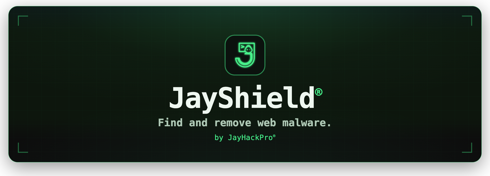
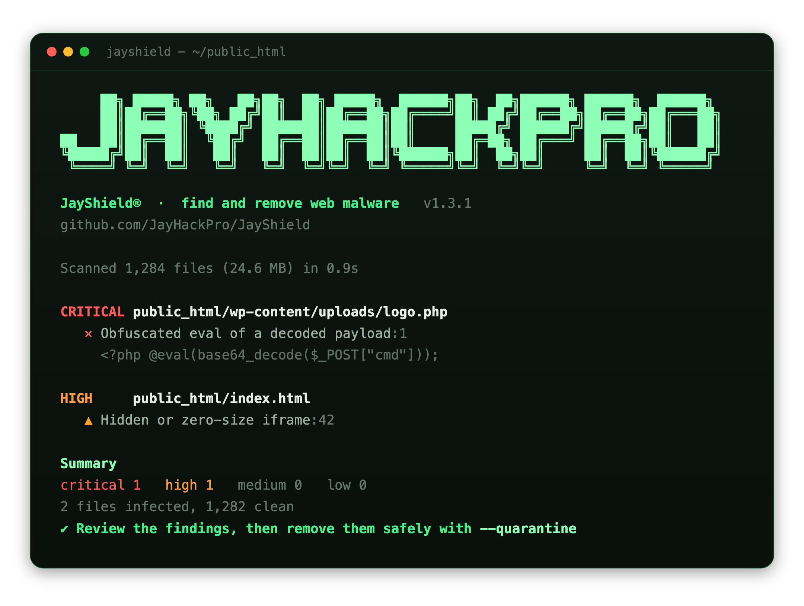

<div align="center">



A fast, dependency-free malware scanner and remover for websites and servers.<br>
Point it at a folder, see exactly what is infected, then quarantine the threats safely.

[](https://www.npmjs.com/package/@jayhackpro/jayshield)
[](LICENSE)
[](package.json)
[](package.json)
[](https://github.com/JayHackPro/JayShield/actions)

**[Website](https://jayhackpro.github.io/JayShield/)**  ·  **[npm](https://www.npmjs.com/package/@jayhackpro/jayshield)**  ·  by **[JayHackPro](https://www.JayHackPro.com)**

</div>

---

## Why JayShield

When a website is hacked, the attacker usually leaves something behind: a PHP
webshell in the uploads folder, an obfuscated backdoor tacked onto a real file,
an invisible iframe on the homepage, or a cryptocurrency miner buried in a
script. Finding these by hand across thousands of files is slow and easy to get
wrong.

JayShield does it in seconds. It reads every file, matches it against a library
of malware techniques, checks its exact fingerprint against known bad files,
and looks for the telltale shapes of packed and hidden code. Then it shows you
a clear, ranked report and offers to move the threats into a local vault so your
site stops serving them right away.

It is one small tool with no dependencies, so you can trust it, read it, and run
it anywhere Node is installed.

## Requirements

- **Node.js 18 or newer** on the machine that runs the scan. Check with
  `node -v`. If that prints nothing or an older version, install Node from
  [nodejs.org](https://nodejs.org/) (macOS, Windows, and Linux installers).
- **The site's files on that machine.** JayShield reads files on disk. It does
  not connect to a website address, so `jayshield https://example.com` is
  refused with an explanation. See [Scan a WordPress site](#scan-a-wordpress-site)
  for the two ways to get the files in front of it.

Nothing else: no account, no PHP, no database access, no background service.

## Quick start

No install required, run it straight from npm:

```bash
npx @jayhackpro/jayshield ./public_html
```

Prove it works on your machine first, using the harmless, industry-standard test file:

```bash
npx @jayhackpro/jayshield --selftest
```

Or install it once and call it by name:

```bash
npm install -g @jayhackpro/jayshield
jayshield ./public_html
```

The examples below write `jayshield` for short, meaning however you choose to run it.

## Scan a WordPress site

JayShield finds the files an attacker planted or changed. To do that it needs
the site's files, so pick whichever of these fits your hosting.

**Path A: run it on the server.** If your host gives you SSH (most VPS plans,
managed WordPress hosts, and many shared hosts), log in and check for Node:

```bash
ssh you@your-server
node -v
```

If Node is there, scan the site root, which is usually `public_html`, `htdocs`,
`www`, or `/var/www/<your-site>`:

```bash
npx @jayhackpro/jayshield ~/public_html
```

If Node is missing and you cannot install it, use Path B. On many shared hosts
you can install Node without root through cPanel's "Setup Node.js App" or with
[nvm](https://github.com/nvm-sh/nvm).

**Path B: scan a downloaded copy.** This works on any hosting, including
hosting with no SSH at all. Download the whole site folder with an SFTP client
(FileZilla, Cyberduck, WinSCP), with the "compress and download" button in your
host's file manager, or from a full backup made by your backup plugin. Unzip it
on your own computer and scan the folder:

```bash
npx @jayhackpro/jayshield ~/Downloads/example.com
```

The report is about the copy. Nothing on the live site changes, so clean the
live site by hand using the paths in the report: delete planted files over SFTP
and replace infected WordPress files with clean copies (see below).

**Scan the whole site root, not just `wp-content`.** Attackers also edit
`wp-config.php`, `.htaccess`, and the root `index.php`, and JayShield can only
report on what it is pointed at. For a deeper scan add `--include vendor` so
plugin dependency folders are read too.

**Reading the results on a WordPress site.** JayShield recognises a WordPress
install, prints its version, and tags each flagged file that belongs to
WordPress itself:

- **No tag** (`wp-content/uploads`, `wp-content/cache`, a stray file in the
  root): almost always planted. Quarantine it.
- **`[wordpress config]`**, **`[wordpress core]`**, **`[wordpress theme]`**,
  **`[wordpress plugin]`**: a real file with injected code. The whole file is
  untrusted, so replace it with a clean copy of the same version (core and
  plugins from wordpress.org, the theme from where you got it) rather than only
  removing it. Quarantining one of these takes the site or the theme offline
  until you do; `--restore` puts it back if that happens.

**After the scan.** Removing the files is the start, not the end. Do these too,
because JayShield cannot:

1. Update WordPress, every plugin, and every theme, and delete the ones you do
   not use. The way in was almost always an outdated or nulled one.
2. Change every password: WordPress admins, hosting panel, SFTP, and the
   database user in `wp-config.php`. Rotate the salts in `wp-config.php` with
   [new values](https://api.wordpress.org/secret-key/1.1/salt/).
3. Look for admin users you did not create, in Users, and remove them.
4. Check the database, which JayShield never reads: `siteurl` and `home` in
   `wp_options`, unknown entries in `wp_options`, and `<script>` or `<iframe>`
   tags inside `wp_posts` content.
5. Verify core against the official checksums with
   [WP-CLI](https://wp-cli.org/): `wp core verify-checksums`. This catches
   changed core files that match no signature.
6. Read `.htaccess` for redirects you did not write.
7. If Google flagged the site, request a review in Search Console once it is
   clean.

## What a scan looks like

A report ranked by severity, with the exact line and a plain-language reason for every finding:

<div align="center">

</div>

## What it catches

- **Webshells**: c99, r57, WSO, b374k, FilesMan, and the generic remote file
  managers and command runners built on the same patterns.
- **Backdoors**: `eval` of request input, variable functions driven by
  `$_GET` and `$_POST`, the `preg_replace` `/e` trick, remote payloads that are
  fetched and run, hardcoded password gates, and reverse shells.
- **Obfuscation**: decode then run payloads, character code and hex string
  tricks, packed one-liners, and large encoded blobs paired with a decoder.
- **Injected front-end malware**: hidden or zero-size iframes, `document.write`
  of unescaped markup, `eval(atob(...))`, and redirects to decoded URLs.
- **Cryptocurrency miners**: CoinHive and the browser mining scripts that spend
  your visitors' devices.
- **Skimmers and spam**: session cookie exfiltration and blocks of hidden SEO or
  pharma spam links.
- **Disguised files**: PHP hidden inside something that claims to be an image,
  double extensions like `invoice.pdf.php`, and executable scripts sitting in an
  uploads folder where only static files belong.
- **Known bad files**: exact matches against a hash set you can extend, plus the
  EICAR antivirus test file.

## Remove threats safely

JayShield never deletes your files. When you are ready to clean up, quarantine
moves each flagged file into a local vault and records where it came from, so
your live site stops serving it at once while every byte is kept.

On a WordPress site, check the tags in the report first. Files tagged
`[wordpress core]`, `[wordpress config]`, `[wordpress theme]`, or
`[wordpress plugin]` are the site's own code with something injected;
quarantining them takes the site or the theme offline until you replace them
with clean copies. Run `--dry-run` first so you know what will move.

```bash
# preview what would move, changing nothing
jayshield ./public_html --quarantine --dry-run

# move every threat into the vault
jayshield ./public_html --quarantine

# see what is in the vault
jayshield --list

# put a file back if a detection was wrong
jayshield --restore <id>

# put everything back
jayshield --restore
```

If you have confirmed the files are malicious and want the disk space back, and
only then, you can permanently delete the vault:

```bash
jayshield --purge --yes
```

## Command reference

```
jayshield [paths...] [options]
```

| Option | What it does |
| --- | --- |
| `--quarantine` | Move every threat into the local vault |
| `--restore [id]` | Put quarantined files back, one or all |
| `--list` | Show what is in the vault |
| `--purge --yes` | Permanently delete the vault (last resort) |
| `--min-severity <level>` | `critical`, `high`, `medium`, or `low` |
| `--ignore-rule <id,...>` | Silence one or more rules by id |
| `--include <dir,...>` | Scan folders that are skipped by name, or `all` |
| `--hashes <file>` | Add known bad sha256 hashes, one per line |
| `--max-size <MB>` | Skip files larger than this (default 5) |
| `--vault <dir>` | Quarantine folder (default `.jayshield-quarantine`) |
| `--follow-symlinks` | Follow symbolic links (off by default) |
| `--dry-run` | Show actions without changing anything |
| `--json` | Machine-readable output for pipelines |
| `--no-color` | Plain text |
| `--no-banner` | Hide the startup banner |
| `--banner` | Print the JayHackPro banner and exit |
| `-v, --verbose` | Include rule ids and references |
| `--selftest` | Detect the EICAR test file end to end |
| `-V, --version` | Print the version |
| `-h, --help` | Show help |

Exit codes: `0` clean, `1` threats found, `2` error. That makes JayShield easy
to drop into a CI pipeline or a cron job.

**What is skipped, and how to see it.** Folders named `.git`, `.svn`, `.hg`,
`node_modules`, `vendor`, `.cache`, and the quarantine vault are skipped by
default so a project scan stays fast, and files over 5 MB are skipped for size.
The report says how many folders were skipped and which names, so a clean
result is never quieter than it should be. `--include vendor` scans one of
them, `--include all` scans everything, `--max-size` raises the size cap.
A folder named plainly `cache` is scanned: on WordPress, `wp-content/cache` is
a favourite place to plant a shell.

## Use it in a pipeline

```bash
# fail the build if anything high or worse is found
jayshield ./release --min-severity high || exit 1

# save a JSON report
jayshield ./public_html --json > jayshield-report.json
```

## Use it from code

Install it, then import the pieces you need:

```bash
npm install @jayhackpro/jayshield
```

```js
import { scan, quarantineFiles } from "@jayhackpro/jayshield";

const result = await scan(["./public_html"], { includeDirs: ["vendor"] });
console.log(`${result.infected.length} infected of ${result.stats.scanned} scanned`);
for (const site of result.sites) console.log(`WordPress ${site.version} at ${site.root}`);

// Quarantine planted files. Files tagged as the site's own code need a clean copy instead.
const planted = result.infected.filter((r) => !r.site);
if (planted.length) {
  await quarantineFiles(planted, { vaultDir: ".vault" });
}
```

## Extend it

**Add your own known bad hashes.** Keep a text file with one `sha256` per line,
an optional label after it, and pass it with `--hashes`:

```
# my-threats.txt
e3b0c44298fc1c149afbf4c8996fb92427ae41e4649b934ca495991b7852b855  seen on client site
```

**Silence a noisy rule.** If a rule flags something you know is safe, pass its id:

```bash
jayshield . --ignore-rule js.packer,spam.pharma
```

**Write new rules.** Signatures live in [`src/rules.js`](src/rules.js) as small,
readable objects. Each one has an id, a severity, the file kinds it applies to,
and a pattern. Add one, add a test in [`test/rules.test.mjs`](test/rules.test.mjs),
and send a pull request.

## What JayShield can and cannot promise

JayShield is a fast first responder for web malware: a file scanner you run on
demand, read in full, and script.

**It can:**

- Read every file under the folders you name, except the skipped folder names
  and oversized files it tells you about, and match each one against its
  signature library, its heuristics, and the known bad hash set.
- Show the exact file, line, and evidence for every finding, so you can judge
  it yourself.
- Recognise a WordPress install and tell you which flagged files are the site's
  own code, so you replace those and remove the rest.
- Quarantine without data loss. Every moved file is kept byte for byte and can
  be restored.
- Fit a pipeline: JSON output, exit codes, no dependencies, no network calls.

**It cannot:**

- Scan a website by its address. It has no crawler, and a webshell in
  `wp-content/uploads` is invisible from the outside anyway. Get the files.
- Read a database. Malware that lives in `wp_options` or inside posts, and rogue
  admin users, are out of its sight.
- Prove a file is unchanged. It has no copy of the official WordPress, plugin,
  or theme checksums; use `wp core verify-checksums` for that.
- Know which plugin versions are vulnerable, or how the attacker got in.
- Watch in real time, block requests, or replace a firewall and backups.
- Catch everything. Signatures and heuristics find known techniques. A clean
  report means nothing matched, not that the site is clean.
- Be right every time. Odd but legitimate code can trip a heuristic. The report
  shows the line so you can decide, and `--ignore-rule` silences a rule you
  have checked.

**How it is checked.** Before a release the rules are run over real, clean
code and must report nothing. For 1.3.1 (September 2026) that corpus was
WordPress 7.1 with and without `--include vendor`, WooCommerce 11.1.0, the
Astra theme 4.13.11, jQuery 3.7.1, and Laravel 12.x, over twelve thousand files
in all, with zero findings. The same run must still catch every planted threat
in the test fixtures. The test suite runs on every change on Node 18, 20, and
22. If JayShield flags a clean file on your site, that is a bug worth
[reporting](https://github.com/JayHackPro/JayShield/issues).

## Development

```bash
npm test        # run the full suite on Node's built in test runner
npm run selftest
```

Zero runtime dependencies, by design. A security tool should be small enough to
read.

## About JayHackPro

JayShield is built and maintained by **JayHackPro® Inc.**, a software
development company focused on cybersecurity, based in Los Angeles, California.

> Let's make the world a better place.

- Website: [JayHackPro.com](https://www.JayHackPro.com)
- X: [@JayHackPro](https://x.com/JayHackPro)
- Contact: info@JayHackPro.com

Designed by Jayden Yoon ZK.

## License

[MIT](LICENSE). Use it freely in your own projects and on your own servers, and
keep the notice. The brand stays behind the code.
